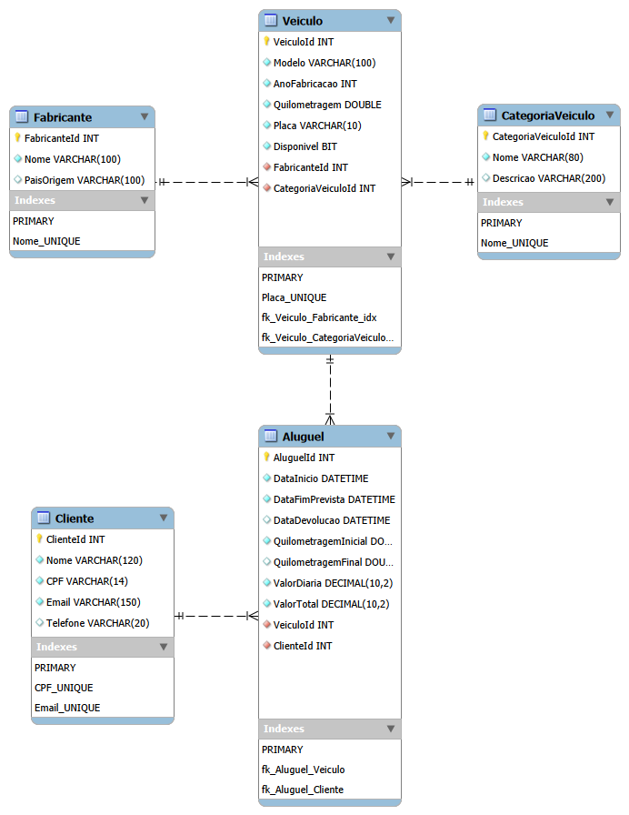

# Etapa 1 - Modelagem do Banco de Dados

A primeira etapa do projeto tem como objetivo realizar a modelagem do banco de dados de um sistema de aluguel de veículos.

Foram definidas as entidades principais do domínio, seus atributos, chaves primárias, chaves estrangeiras, relacionamentos e restrições de integridade.

O modelo foi posteriormente implementado em C# com Entity Framework Core e traduzido para um banco de dados relacional SQL Server.

## Entidades do sistema

### Fabricante

Representa o fabricante ou marca responsável pelos veículos cadastrados na locadora.

**Atributos:**
- `FabricanteId` - chave primária
- `Nome` - obrigatório e único
- `PaisOrigem` - opcional

**Relacionamento:**
- Um fabricante pode possuir vários veículos.

### CategoriaVeiculo

Representa a categoria à qual o veículo pertence, permitindo classificar a frota em grupos como SUV, Sedan, Hatch, Utilitário, entre outros.

**Atributos:**
- `CategoriaVeiculoId` - chave primária
- `Nome` - obrigatório e único
- `Descricao` - opcional

**Relacionamento:**
- Uma categoria pode possuir vários veículos.

### Veiculo

Representa os veículos disponíveis na frota da locadora.

**Atributos:**
- `VeiculoId` - chave primária
- `Modelo`
- `AnoFabricacao`
- `Quilometragem`
- `Placa` - única
- `Disponivel`
- `FabricanteId` - chave estrangeira
- `CategoriaVeiculoId` - chave estrangeira

**Relacionamentos:**
- Cada veículo pertence a um fabricante.
- Cada veículo pertence a uma categoria.
- Um veículo pode participar de vários aluguéis ao longo do tempo.

### Cliente

Representa os clientes que podem realizar locações de veículos.

**Atributos:**
- `ClienteId` - chave primária
- `Nome`
- `CPF` - único
- `Email` - único
- `Telefone` - opcional

**Relacionamento:**
- Um cliente pode realizar vários aluguéis.

### Aluguel

Representa cada locação realizada no sistema, relacionando um cliente a um veículo durante determinado período.

**Atributos:**
- `AluguelId` - chave primária
- `DataInicio`
- `DataFimPrevista`
- `DataDevolucao` - opcional
- `QuilometragemInicial`
- `QuilometragemFinal` - opcional
- `ValorDiaria`
- `ValorTotal`
- `ClienteId` - chave estrangeira
- `VeiculoId` - chave estrangeira

Os campos `DataDevolucao` e `QuilometragemFinal` foram definidos como opcionais porque essas informações ainda não estão disponíveis enquanto o aluguel estiver em andamento.

## Relacionamentos

| Entidade principal | Entidade relacionada | Cardinalidade | Descrição |
|---|---|---|---|
| Fabricante | Veiculo | 1:N | Um fabricante pode possuir vários veículos |
| CategoriaVeiculo | Veiculo | 1:N | Uma categoria pode classificar vários veículos |
| Cliente | Aluguel | 1:N | Um cliente pode realizar vários aluguéis |
| Veiculo | Aluguel | 1:N | Um veículo pode participar de várias locações |

## Modelo lógico/relacional

O modelo abaixo representa as entidades, atributos, chaves primárias, chaves estrangeiras e relacionamentos utilizados no sistema.



## Chaves primárias

As seguintes propriedades foram definidas como chaves primárias:

- `Fabricante.FabricanteId`
- `CategoriaVeiculo.CategoriaVeiculoId`
- `Veiculo.VeiculoId`
- `Cliente.ClienteId`
- `Aluguel.AluguelId`

## Chaves estrangeiras

As seguintes propriedades foram definidas como chaves estrangeiras:

- `Veiculo.FabricanteId` → `Fabricante.FabricanteId`
- `Veiculo.CategoriaVeiculoId` → `CategoriaVeiculo.CategoriaVeiculoId`
- `Aluguel.ClienteId` → `Cliente.ClienteId`
- `Aluguel.VeiculoId` → `Veiculo.VeiculoId`

## Restrições de integridade

Foram configuradas restrições adicionais com o objetivo de preservar a integridade dos dados.

### Valores únicos

- `Fabricante.Nome`
- `CategoriaVeiculo.Nome`
- `Veiculo.Placa`
- `Cliente.CPF`
- `Cliente.Email`

### Campos obrigatórios

Foram definidos como obrigatórios os principais atributos necessários para o funcionamento do sistema, como:

- nome do fabricante;
- nome da categoria;
- modelo do veículo;
- ano de fabricação;
- quilometragem;
- placa;
- nome do cliente;
- CPF;
- e-mail;
- datas do aluguel;
- quilometragem inicial;
- valor da diária;
- cliente associado;
- veículo associado.

## Entity Framework Core

O Entity Framework Core foi utilizado para realizar o mapeamento das classes C# para o banco de dados relacional.

A classe `ApplicationContext` herda de `DbContext` e contém os `DbSet`s correspondentes às entidades do sistema:

```csharp
public DbSet<Fabricante> Fabricantes { get; set; }
public DbSet<CategoriaVeiculo> CategoriasVeiculo { get; set; }
public DbSet<Veiculo> Veiculos { get; set; }
public DbSet<Cliente> Clientes { get; set; }
public DbSet<Aluguel> Alugueis { get; set; }