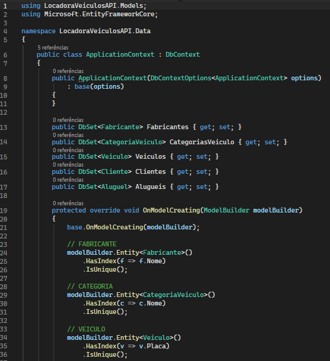
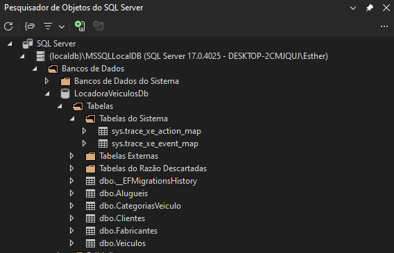

# Etapa 1 - Modelagem do Banco de Dados

A primeira etapa do projeto tem como objetivo realizar a modelagem do banco de dados de um sistema de aluguel de veículos.
Foram definidas as entidades principais do domínio, seus atributos, chaves primárias, chaves estrangeiras, relacionamentos e restrições de integridade.
O modelo foi posteriormente implementado em C# com Entity Framework Core e traduzido para um banco de dados relacional SQL Server.

## Entidades do sistema

### Fabricante
Representa o fabricante ou marca responsável pelos veículos cadastrados na locadora.

**Atributos:**
- `FabricanteId` - chave primária
- `Nome` - obrigatório e único
- `PaisOrigem` - opcional

**Relacionamento:**
- Um fabricante pode possuir vários veículos.

### CategoriaVeiculo

Representa a categoria à qual o veículo pertence, permitindo classificar a frota em grupos como SUV, Sedan, Hatch, Utilitário, entre outros.

**Atributos:**
- `CategoriaVeiculoId` - chave primária
- `Nome` - obrigatório e único
- `Descricao` - opcional

**Relacionamento:**
- Uma categoria pode possuir vários veículos.

### Veiculo

Representa os veículos disponíveis na frota da locadora.

**Atributos:**
- `VeiculoId` - chave primária
- `Modelo`
- `AnoFabricacao`
- `Quilometragem`
- `Placa` - única
- `Disponivel`
- `FabricanteId` - chave estrangeira
- `CategoriaVeiculoId` - chave estrangeira

**Relacionamentos:**
- Cada veículo pertence a um fabricante.
- Cada veículo pertence a uma categoria.
- Um veículo pode participar de vários aluguéis ao longo do tempo.

### Cliente

Representa os clientes que podem realizar locações de veículos.

**Atributos:**
- `ClienteId` - chave primária
- `Nome`
- `CPF` - único
- `Email` - único
- `Telefone` - opcional

**Relacionamento:**
- Um cliente pode realizar vários aluguéis.

### Aluguel

Representa cada locação realizada no sistema, relacionando um cliente a um veículo durante determinado período.

**Atributos:**
- `AluguelId` - chave primária
- `DataInicio`
- `DataFimPrevista`
- `DataDevolucao` - opcional
- `QuilometragemInicial`
- `QuilometragemFinal` - opcional
- `ValorDiaria`
- `ValorTotal`
- `ClienteId` - chave estrangeira
- `VeiculoId` - chave estrangeira

Os campos `DataDevolucao` e `QuilometragemFinal` foram definidos como opcionais porque essas informações ainda não estão disponíveis enquanto o aluguel estiver em andamento.

## Relacionamentos

| Entidade principal | Entidade relacionada | Cardinalidade | Descrição |
|---|---|---|---|
| Fabricante | Veiculo | 1:N | Um fabricante pode possuir vários veículos |
| CategoriaVeiculo | Veiculo | 1:N | Uma categoria pode classificar vários veículos |
| Cliente | Aluguel | 1:N | Um cliente pode realizar vários aluguéis |
| Veiculo | Aluguel | 1:N | Um veículo pode participar de várias locações |

## Modelo lógico/relacional

O modelo abaixo representa as entidades, atributos, chaves primárias, chaves estrangeiras e relacionamentos utilizados no sistema.


## Chaves primárias

As seguintes propriedades foram definidas como chaves primárias:

- `Fabricante.FabricanteId`
- `CategoriaVeiculo.CategoriaVeiculoId`
- `Veiculo.VeiculoId`
- `Cliente.ClienteId`
- `Aluguel.AluguelId`

## Chaves estrangeiras

As seguintes propriedades foram definidas como chaves estrangeiras:

- `Veiculo.FabricanteId` → `Fabricante.FabricanteId`
- `Veiculo.CategoriaVeiculoId` → `CategoriaVeiculo.CategoriaVeiculoId`
- `Aluguel.ClienteId` → `Cliente.ClienteId`
- `Aluguel.VeiculoId` → `Veiculo.VeiculoId`

## Restrições de integridade

Foram configuradas restrições adicionais com o objetivo de preservar a integridade dos dados.

### Valores únicos

- `Fabricante.Nome`
- `CategoriaVeiculo.Nome`
- `Veiculo.Placa`
- `Cliente.CPF`
- `Cliente.Email`

### Campos obrigatórios

Foram definidos como obrigatórios os principais atributos necessários para o funcionamento do sistema, como:

- nome do fabricante;
- nome da categoria;
- modelo do veículo;
- ano de fabricação;
- quilometragem;
- placa;
- nome do cliente;
- CPF;
- e-mail;
- datas do aluguel;
- quilometragem inicial;
- valor da diária;
- cliente associado;
- veículo associado.

## Entity Framework Core

O Entity Framework Core foi utilizado para realizar o mapeamento das classes C# para o banco de dados relacional.

A classe `ApplicationContext` herda de `DbContext` e contém os `DbSet`s correspondentes às entidades do sistema:

```csharp
public DbSet<Fabricante> Fabricantes { get; set; }
public DbSet<CategoriaVeiculo> CategoriasVeiculo { get; set; }
public DbSet<Veiculo> Veiculos { get; set; }
public DbSet<Cliente> Clientes { get; set; }
public DbSet<Aluguel> Alugueis { get; set; }
```

Além dos `DbSet`s, o método `OnModelCreating` foi utilizado para configurar os relacionamentos entre as entidades e as restrições de unicidade do banco de dados.

Entre as configurações realizadas estão:

* relacionamento entre `Fabricante` e `Veiculo`;
* relacionamento entre `CategoriaVeiculo` e `Veiculo`;
* relacionamento entre `Cliente` e `Aluguel`;
* relacionamento entre `Veiculo` e `Aluguel`;
* restrição de unicidade para nome do fabricante;
* restrição de unicidade para nome da categoria;
* restrição de unicidade para placa do veículo;
* restrição de unicidade para CPF do cliente;
* restrição de unicidade para e-mail do cliente.

## Banco de dados

O banco de dados foi criado no SQL Server por meio das migrations do Entity Framework Core.

A migration inicial criada foi:

```
InitialCreate
```

Para criar a migration foi utilizado o comando:

```
Add-Migration InitialCreate
```

Em seguida, a estrutura definida no projeto foi aplicada ao banco de dados por meio do comando:

```
Update-Database
```

O banco de dados criado foi:

`LocadoraVeiculosDb`

As principais tabelas geradas foram:

* `Fabricantes`
* `CategoriasVeiculo`
* `Veiculos`
* `Clientes`
* `Alugueis`

Também foi criada automaticamente pelo Entity Framework Core a tabela:

`__EFMigrationsHistory`

Essa tabela é utilizada pelo Entity Framework Core para controlar quais migrations já foram aplicadas ao banco de dados.

## Evidências

### ApplicationContext

A classe `ApplicationContext` foi configurada para mapear as cinco entidades do sistema e seus relacionamentos por meio do Entity Framework Core.

A imagem abaixo apresenta parte da configuração realizada no projeto:



### Banco de dados no SQL Server

Após a execução da migration inicial, o banco `LocadoraVeiculosDb` foi criado no SQL Server com as tabelas correspondentes às entidades modeladas.

A imagem abaixo apresenta as tabelas geradas no banco de dados:



## Estrutura implementada

Ao final desta etapa, o projeto possui cinco entidades principais:

* `Fabricante`
* `CategoriaVeiculo`
* `Veiculo`
* `Cliente`
* `Aluguel`

As entidades foram implementadas como classes C# e mapeadas para o banco de dados utilizando Entity Framework Core.

Os relacionamentos definidos permitem representar corretamente o funcionamento básico de uma locadora de veículos, incluindo a associação dos veículos aos seus fabricantes e categorias e o vínculo de cada aluguel a um cliente e a um veículo.

## Conclusão

A Etapa 1 permitiu definir e implementar a estrutura inicial do banco de dados do sistema de aluguel de veículos.

Foram modeladas cinco entidades relacionadas, contemplando as entidades principais solicitadas para o sistema e a entidade adicional `CategoriaVeiculo`, utilizada para organizar e classificar os veículos da frota.

Também foram definidas chaves primárias, chaves estrangeiras, campos obrigatórios e restrições de unicidade para dados importantes, como placa, CPF e e-mail.

Por meio do Entity Framework Core, as classes C# foram mapeadas para o banco de dados relacional, e a migration inicial permitiu gerar no SQL Server as tabelas correspondentes ao modelo desenvolvido.

Dessa forma, a estrutura criada nesta etapa estabelece a base necessária para o desenvolvimento das próximas funcionalidades do sistema, como cadastro, consulta, atualização e exclusão de registros, além do gerenciamento dos aluguéis de veículos. 
