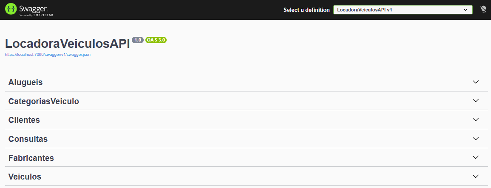
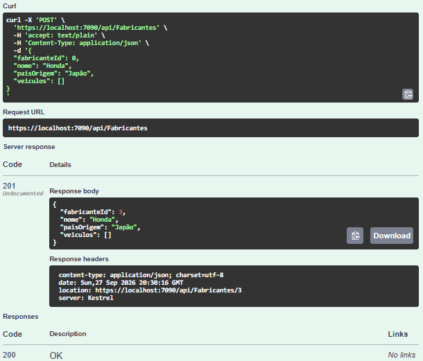
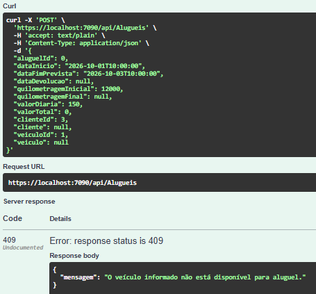
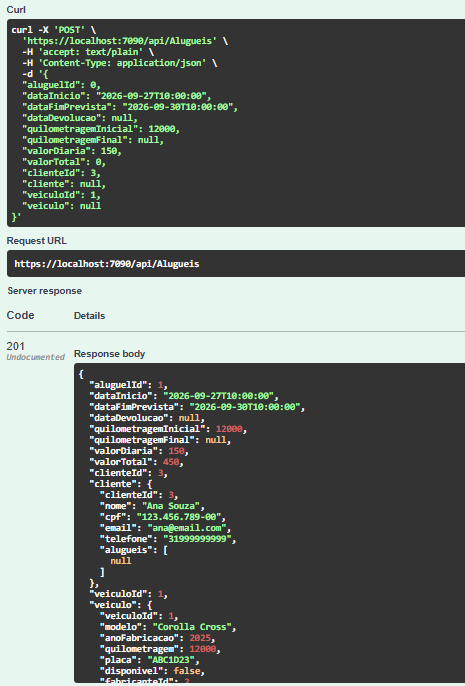
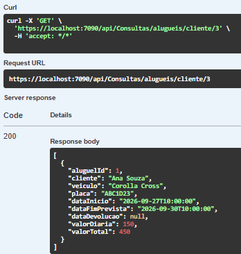
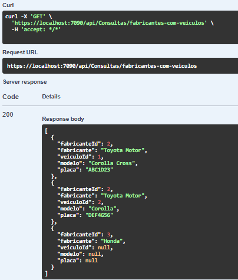

# Etapa 2 - Implementação do Backend

A segunda etapa do projeto teve como objetivo implementar as operações principais da API do sistema de aluguel de veículos.

Nesta etapa foram desenvolvidos os CRUDs das entidades do sistema, a persistência dos dados utilizando Entity Framework Core e SQL Server, validações de dados, tratamento de erros, filtros de consulta e operações envolvendo relacionamentos entre as entidades.

## CRUD das entidades

Foram implementadas operações completas de cadastro, consulta, atualização e exclusão para as seguintes entidades:

- `Fabricante`
- `CategoriaVeiculo`
- `Cliente`
- `Veiculo`
- `Aluguel`

Os endpoints foram implementados utilizando Controllers do ASP.NET Core e disponibilizados para teste por meio do Swagger.

### Principais operações

Cada entidade possui, de acordo com sua necessidade, os seguintes endpoints:

- `GET` - consulta de todos os registros
- `GET /{id}` - consulta de um registro específico
- `POST` - criação de novo registro
- `PUT /{id}` - atualização de registro
- `DELETE /{id}` - exclusão de registro

## Swagger

O Swagger foi configurado para permitir a visualização e execução dos endpoints da API diretamente pelo navegador.

A imagem abaixo apresenta os principais controllers disponíveis na aplicação:



## Persistência de dados

A persistência dos dados foi realizada utilizando:

- Entity Framework Core
- SQL Server
- ApplicationContext
- Migrations

As operações realizadas por meio da API são armazenadas no banco de dados `LocadoraVeiculosDb`.

Os controllers utilizam o `ApplicationContext` para acessar os `DbSet`s das entidades e realizar operações assíncronas no banco de dados.

## Exemplo de cadastro

A API permite cadastrar registros utilizando requisições HTTP do tipo `POST`.

A imagem abaixo apresenta um exemplo de cadastro realizado com sucesso, retornando o status `201 Created`:



## Validações e tratamento de erros

Foram implementadas validações para impedir o armazenamento ou processamento de dados inválidos. 

Entre as principais validações estão:

- verificação de registros inexistentes;
- validação de campos obrigatórios;
- validação de e-mail;
- prevenção de CPF duplicado;
- prevenção de e-mail duplicado;
- prevenção de placa duplicada;
- prevenção de nome de fabricante duplicado;
- prevenção de nome de categoria duplicado;
- validação do ano de fabricação;
- validação de quilometragem negativa;
- validação de fabricante inexistente;
- validação de categoria inexistente;
- validação de cliente inexistente;
- validação de veículo inexistente;
- validação de datas de aluguel;
- validação do valor da diária;
- prevenção de aluguel de veículo indisponível;
- prevenção de devolução duplicada.

A API utiliza diferentes códigos de resposta HTTP de acordo com cada situação.

Entre os principais estão:

- `200 OK`
- `201 Created`
- `204 No Content`
- `400 Bad Request`
- `404 Not Found`
- `409 Conflict`

A imagem abaixo apresenta um exemplo de tratamento de erro da aplicação:



## Regras de negócio do aluguel

A entidade `Aluguel` possui regras de negócio específicas para representar o funcionamento de uma locadora de veículos.

Ao criar um aluguel, o sistema:

- verifica se o cliente existe;
- verifica se o veículo existe;
- verifica se o veículo está disponível;
- valida o período informado;
- valida a quilometragem inicial;
- valida o valor da diária;
- calcula automaticamente o valor total do aluguel;
- altera o veículo para indisponível durante a locação.

O valor total é calculado com base na quantidade de dias e no valor da diária.

Exemplo:

```
3 dias × R$ 150,00 = R$ 450,00
```

A imagem abaixo apresenta um aluguel criado com sucesso:



## Devolução do veículo

Foi implementado um endpoint específico para registrar a devolução:

```
PUT /api/Alugueis/{id}/devolucao
```

Durante a devolução, o sistema:

- registra a data de devolução;
- registra a quilometragem final;
- atualiza a quilometragem do veículo;
- altera o veículo novamente para disponível;
- impede que a mesma devolução seja registrada mais de uma vez.

## Consultas e filtros

Além dos CRUDs, foram implementados filtros específicos para facilitar as consultas no sistema.

### 1. Veículos por fabricante

```
GET /api/Consultas/veiculos/fabricante/{fabricanteId}
```

Permite consultar todos os veículos associados a determinado fabricante.

### 2. Veículos por categoria

```
GET /api/Consultas/veiculos/categoria/{categoriaId}
```

Permite consultar veículos de uma determinada categoria.

### 3. Veículos disponíveis

```
GET /api/Consultas/veiculos/disponiveis
```

Retorna somente os veículos disponíveis para aluguel.

### 4. Aluguéis por cliente

```
GET /api/Consultas/alugueis/cliente/{clienteId}
```

Permite consultar o histórico de aluguéis de determinado cliente.

### 5. Aluguéis por período

```
GET /api/Consultas/alugueis/periodo
```

Permite consultar aluguéis realizados dentro de determinado intervalo de datas.

## INNER JOIN

Foram utilizadas consultas com `INNER JOIN` para combinar informações relacionadas entre diferentes entidades.

Um dos exemplos implementados relaciona:

- `Aluguel`
- `Cliente`
- `Veiculo`

A consulta permite obter informações do aluguel juntamente com o nome do cliente e os dados do veículo relacionado.

Exemplo de endpoint:

```
GET /api/Consultas/alugueis/cliente/{clienteId}
```

A imagem abaixo apresenta o resultado da consulta utilizando `INNER JOIN`:



## LEFT JOIN

Também foi implementada uma consulta utilizando `LEFT JOIN`.

Nesse caso, o objetivo é listar todos os fabricantes, inclusive aqueles que ainda não possuem veículos cadastrados.

Endpoint:

```
GET /api/Consultas/fabricantes-com-veiculos
```

Dessa forma, um fabricante sem veículos continua sendo retornado no resultado da consulta.

A imagem abaixo apresenta o resultado do `LEFT JOIN`:



## Controllers implementados

Ao final desta etapa foram implementados os seguintes controllers:

- `FabricantesController`
- `CategoriasVeiculoController`
- `ClientesController`
- `VeiculosController`
- `AlugueisController`
- `ConsultasController`

## Recursos implementados

Ao final da Etapa 2, o backend possui:

- CRUD completo das cinco entidades;
- persistência com Entity Framework Core;
- integração com SQL Server;
- tratamento de erros;
- validações de dados;
- regras de negócio para aluguel;
- controle de disponibilidade de veículos;
- registro de devolução;
- cálculo automático do valor total;
- cinco tipos de filtros;
- consultas utilizando INNER JOIN;
- consultas utilizando LEFT JOIN;
- documentação e testes por meio do Swagger.


## Conclusão

A Etapa 2 permitiu transformar a estrutura de dados definida na primeira etapa em uma API funcional para gerenciamento de uma locadora de veículos.

Foram implementadas operações de cadastro, consulta, atualização e exclusão para as entidades do sistema, além de validações e regras de negócio necessárias para manter a integridade dos dados.

A utilização do Entity Framework Core possibilitou a integração entre as classes C# e o banco de dados SQL Server, enquanto o Swagger permitiu testar e validar os endpoints desenvolvidos.

Também foram implementadas consultas específicas utilizando filtros e relacionamentos entre entidades, incluindo operações com `INNER JOIN` e `LEFT JOIN`.

Com isso, o sistema passa a possuir uma base de backend funcional e preparada para as próximas etapas do projeto.
